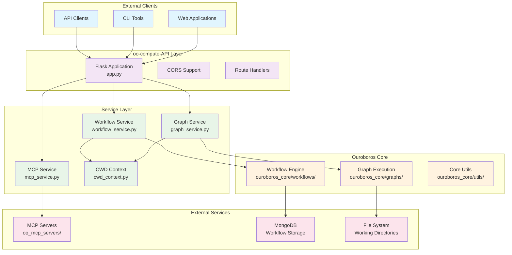

# Ouroboros Deploy - Technical Overview

**Lightweight deployment repository for the complete Ouroboros AI Agent Framework**

---

## 1. Introduction

This repository provides a **lightweight deployment solution** for the Ouroboros AI Agent Framework via Docker containers. The main component is the **oo-compute-api** - a comprehensive Flask-based REST API that serves as the primary interface for interacting with the Ouroboros ecosystem programmatically. It provides unified access to graph execution, workflow management, and MCP (Model Context Protocol) server integration.

## Key Features

- **One-Command Deployment**: `docker-compose up -d` starts the entire environment
- **Unified Interface**: `run.py` script provides comprehensive interaction capabilities
- **Pre-built Images**: No compilation needed - pull and run from Docker Hub
- **Cross-Platform**: Works on Windows, macOS, and Linux
- **Production Ready**: Includes MongoDB, Redis, and health monitoring

### Role in the Ouroboros Ecosystem

The oo-compute-API acts as the **service layer** between external clients and the Ouroboros core functionality, providing:

- **Graph Execution Interface**: Direct access to execute any Ouroboros graph with custom input states
- **Workflow Management**: Complete lifecycle management of complex multi-step workflows
- **MCP Integration**: Seamless integration with external MCP servers for enhanced capabilities
- **Service Orchestration**: Centralized coordination of distributed Ouroboros services

---

## 2. Architecture Overview

### High-Level Architecture



### Modular Service Architecture

The API employs a **modular service architecture** with clear separation of concerns:

- **Flask Application Layer**: HTTP request handling, routing, and response formatting
- **Service Layer**: Business logic encapsulation with dedicated service modules
- **Integration Layer**: Context management and external service coordination
- **Core Layer**: Direct integration with Ouroboros core functionality

---

## 3. Core Components

### 3.1 app.py - Main Flask Application

**Purpose**: Central HTTP server providing RESTful endpoints and request orchestration

**Key Features**:
- **CORS Support**: Cross-origin resource sharing for web client integration
- **Modular Routing**: Clean endpoint organization with service delegation
- **Error Handling**: Comprehensive error responses with appropriate HTTP status codes
- **Health Monitoring**: Service health checks and performance metrics
- **Graceful Shutdown**: Signal handling for clean service termination

**Architecture Pattern**:
```python
# Request Flow Pattern
@app.route('/endpoint', methods=['POST'])
def endpoint_handler():
    # 1. Request validation
    # 2. Service delegation
    # 3. Response formatting
    # 4. Error handling
```

**Integration Points**:
- Imports and delegates to all service modules
- Provides unified error handling and logging
- Manages service lifecycle and health monitoring

### 3.2 graph_service.py - Graph Execution Services

**Purpose**: Complete graph management including discovery, loading, and execution

**Core Capabilities**:

#### Graph Discovery
- **`discover_available_graphs()`**: Scans `ouroboros_core/graphs/` directory structure
- **Automatic Classification**: Identifies graph status (ACTIVE in ASIS, STANDALONE, DEPRECATED)
- **Metadata Extraction**: Parses README.md files for descriptions and status information
- **Module Path Resolution**: Creates importable module paths for dynamic loading

#### Graph Loading
- **`load_graph_executable()`**: Dynamic import and instantiation of graph classes
- **Class Detection**: Identifies executable classes through inheritance analysis
- **Fallback Mechanisms**: Multiple strategies for finding executable entry points
- **Error Recovery**: Graceful handling of import and instantiation failures

#### Graph Execution
- **`execute_graph_with_state()`**: Executes graphs with custom input states
- **Context Management**: Uses `ouroboros_cwd_context` for proper working directory
- **State Validation**: Ensures input state completeness and format
- **Result Processing**: Standardized result formatting with execution metadata

**Integration with Ouroboros Core**:
- Direct integration with `ouroboros_core.graphs` module structure
- Utilizes Ouroboros `Executable` wrapper classes
- Maintains compatibility with ASIS coordination patterns
- Supports both synchronous and asynchronous graph execution

### 3.3 mcp_service.py - MCP (Model Context Protocol) Integration

**Purpose**: Comprehensive MCP server management and tool execution

**Core Capabilities**:

#### MCP Server Management
- **`list_mcp_servers_info()`**: Catalogs available MCP servers with security masking
- **`get_mcp_server_status()`**: Connection testing and health monitoring
- **`get_mcp_settings_info()`**: Configuration file analysis and validation

#### Tool Discovery and Execution
- **`get_mcp_tools_detailed()`**: Retrieves tool schemas and descriptions
- **`execute_mcp_tool()`**: Executes MCP tools with argument validation
- **Dynamic Tool Resolution**: Searches across multiple servers for requested tools

#### Security and Configuration
- **`mask_sensitive_env_vars()`**: Protects API keys and sensitive configuration
- **Centralized Configuration**: Uses `ouroboros_core.utils.Helpers.Get_System_Workspace`
- **Connection Pooling**: Efficient MCP client management and reuse

**Integration Points**:
- Leverages centralized MCP functions from Ouroboros core utilities
- Supports workspace directory management for MCP operations
- Provides secure access to external MCP server capabilities

### 3.4 workflow_service.py - Workflow Management Services

**Purpose**: Complete workflow lifecycle management with execution monitoring

**Core Capabilities**:

#### Workflow Discovery and Management
- **`list_workflows_with_filters()`**: Filtered workflow listing with status and compatibility filters
- **`search_workflows_by_query()`**: Full-text search across workflow metadata
- **Lazy Service Loading**: On-demand initialization of workflow execution service

#### Execution Management
- **`execute_workflow_by_name()`**: Workflow execution with ASIS context support
- **`get_workflow_execution_status()`**: Real-time execution monitoring
- **`cancel_workflow_execution()`**: Graceful execution termination
- **Asynchronous Support**: Non-blocking execution with status tracking

#### Analytics and Monitoring
- **`get_workflow_performance_analytics()`**: Performance metrics and execution history
- **`get_active_workflow_executions()`**: Real-time active execution monitoring
- **`get_service_health_metrics()`**: Service performance and health indicators

**Integration with Workflow Engine**:
- Direct integration with `ouroboros_core.workflows.services.execution_service`
- MongoDB-backed persistence for workflow state and history
- ASIS context propagation for strategic workflow coordination

### 3.5 cwd_context.py - Current Working Directory Context Management

**Purpose**: Ensures correct working directory context for Ouroboros code execution

**Key Features**:

#### Context Management
- **`ouroboros_cwd_context()`**: Context manager for safe directory changes
- **Environment Detection**: Automatic Docker vs. local development detection
- **Path Resolution**: Canonical path resolution handling symlinks and aliases

#### Directory Validation
- **`verify_ouroboros_directory()`**: Validates Ouroboros repository structure
- **`get_ouroboros_base_dir()`**: Determines correct base directory path
- **Error Recovery**: Guaranteed restoration of original working directory

**Critical Role**:
- Ensures relative file paths work correctly in containerized environments
- Prevents import and execution errors due to incorrect working directory
- Provides consistent execution context across different deployment scenarios

---

## 4. API Endpoints

### 4.1 Health and Service Monitoring

| Endpoint | Method | Purpose |
|----------|--------|---------|
| `/health` | GET | Basic API health check |
| `/service/health` | GET | Comprehensive service health with component status |
| `/service/metrics` | GET | Service performance metrics and statistics |

### 4.2 Graph Management

| Endpoint | Method | Purpose |
|----------|--------|---------|
| `/graphs` | GET | List all available Ouroboros graphs |
| `/graphs/{graph_name}` | GET | Get detailed information about a specific graph |
| `/graphs/{graph_name}/execute` | POST | Execute a specific graph with input state |
| `/execute` | POST | Generic graph execution endpoint |

**Graph Execution Request Format**:
```json
{
  "input_state": {
    "original_prompt": "Task description",
    "system_workspace": "/workspace/path",
    // ... graph-specific state variables
  },
  "system_kwargs": {
    "verbose": true,
    "enable_streaming": false
  }
}
```

### 4.3 MCP Server Integration

| Endpoint | Method | Purpose |
|----------|--------|---------|
| `/mcp-servers` | GET | List all available MCP servers |
| `/mcp-servers/tools` | GET | Get detailed MCP tool information with schemas |
| `/mcp-servers/status` | GET | Check MCP server connection status |
| `/mcp-servers/settings` | GET | Get MCP settings file information |
| `/mcp-tools/execute` | POST | Execute specific MCP tools with arguments |
| `/workspace/directories` | GET/POST | Get workspace directory information |

**MCP Tool Execution Request Format**:
```json
{
  "tool_name": "search",
  "arguments": {
    "query": "AI research",
    "limit": 10
  },
  "servers": ["perplexity", "github"]
}
```

### 4.4 Workflow Management

| Endpoint | Method | Purpose |
|----------|--------|---------|
| `/workflows` | GET | List workflows with filtering and search |
| `/workflows/{workflow_name}` | GET | Get specific workflow details |
| `/workflows/{workflow_name}/execute` | POST | Execute workflow with input parameters |
| `/workflows/{workflow_name}/analytics` | GET | Get workflow performance analytics |
| `/executions` | GET | List currently active executions |
| `/executions/{execution_id}` | GET | Get execution status and results |
| `/executions/{execution_id}/cancel` | POST | Cancel running execution |

**Workflow Execution Request Format**:
```json
{
  "input_values": {
    "objective": "Market analysis",
    "parameters": {...}
  },
  "system_workspace_dir": "/workspace",
  "async_execution": true,
  "asis_context": {
    "strategy_phase": "analysis"
  }
}
```

---

## 5. Integration Points

### 5.1 Ouroboros Core Graphs

**Integration Pattern**:
- **Graph Discovery**: Automatic scanning of `ouroboros_core/graphs/` directory structure
- **Dynamic Loading**: Runtime import of graph modules and executable classes
- **State Management**: Direct integration with Ouroboros state management patterns
- **ASIS Compatibility**: Full support for ASIS coordination and strategic planning

**Supported Graph Types**:
- **ASIS Graphs**: Central coordination graphs with multi-phase execution
- **Standalone Graphs**: Independent graphs for specific tasks
- **Subgraphs**: Hierarchical graph components used within larger systems

### 5.2 Workflow Management System

**Integration Architecture**:
- **Service Layer**: Integration with `ouroboros_core.workflows.services.execution_service`
- **Persistence Layer**: MongoDB-backed workflow state and execution history
- **Monitoring Layer**: Real-time execution tracking and performance analytics

**Workflow Capabilities**:
- **Template Management**: Pre-defined workflow templates with parameter validation
- **Execution Tracking**: Complete audit trail of workflow executions
- **ASIS Integration**: Strategic context propagation for coordinated workflows

### 5.3 MCP Servers

**Integration Framework**:
- **Configuration Management**: Centralized MCP server configuration via `mcp_settings.json`
- **Client Management**: Efficient MCP client pooling and connection management
- **Tool Discovery**: Dynamic tool discovery across multiple MCP servers
- **Security**: Sensitive data masking and secure credential management

**Supported MCP Servers**:
- **Research Tools**: Perplexity, web scraping, and information gathering
- **Development Tools**: GitHub integration, code analysis, and documentation
- **Specialized Tools**: Domain-specific tools for various use cases

### 5.4 External Clients

**Client Integration Patterns**:
- **Web Applications**: CORS-enabled for browser-based clients
- **CLI Tools**: RESTful API suitable for command-line integration
- **Microservices**: Service-to-service communication with standardized responses
- **Monitoring Systems**: Health check endpoints for service monitoring

---

## 6. Configuration and Setup

### 6.1 Environment Requirements

**Python Dependencies** (requirements.txt):
```
Flask==2.3.3          # Web framework
Flask-CORS==4.0.0     # Cross-origin support
pymongo==4.6.0        # MongoDB integration
mongoengine==0.27.0   # MongoDB ODM
redis==5.0.1          # Caching and session management
jsonschema==4.20.0    # JSON validation
pydantic==2.5.0       # Data validation
motor==3.3.2          # Async MongoDB driver
```

**System Dependencies**:
- **MongoDB**: Workflow persistence and execution history
- **Redis**: Caching and session management (optional)
- **MCP Servers**: External MCP server configurations

### 6.2 Configuration Files

**MCP Configuration** (`../oo_mcp_servers/mcp_settings.json`):
```json
{
  "server_name": {
    "command": "server_command",
    "args": ["arg1", "arg2"],
    "env": {
      "API_KEY": "***MASKED***"
    },
    "timeout": 60,
    "disabled": false
  }
}
```

**Ouroboros Configuration** (`../config.ini`):
- API keys for LLM services
- Database connection strings
- Service-specific configuration parameters

### 6.3 Deployment Scenarios

#### Local Development
```bash
# Install dependencies
pip install -r requirements.txt

# Run the API
python app.py
```

#### Docker Deployment
```dockerfile
# Integrated with main Ouroboros Dockerfile
# Runs as part of containerized environment
# Automatic service discovery and configuration
```

#### Production Deployment
- **Load Balancing**: Multiple API instances behind load balancer
- **Database Scaling**: MongoDB replica sets for high availability
- **Monitoring**: Comprehensive logging and metrics collection
- **Security**: Authentication, rate limiting, and secure communication

---

## 7. Usage Examples

### 7.1 Graph Execution

**Execute ASIS Graph**:
```bash
curl -X POST http://localhost:5001/graphs/ASIS/execute \
  -H "Content-Type: application/json" \
  -d '{
    "input_state": {
      "original_prompt": "Analyze the drone spray market in the upper plains"
    },
    "system_kwargs": {
      "verbose": true
    }
  }'
```

**List Available Graphs**:
```bash
curl http://localhost:5001/graphs
```

### 7.2 Workflow Management

**Execute Workflow**:
```bash
curl -X POST http://localhost:5001/workflows/market_analysis/execute \
  -H "Content-Type: application/json" \
  -d '{
    "input_values": {
      "market_sector": "agriculture",
      "region": "upper_plains"
    },
    "async_execution": true
  }'
```

**Monitor Execution**:
```bash
curl http://localhost:5001/executions/{execution_id}
```

### 7.3 MCP Tool Usage

**Execute Research Tool**:
```bash
curl -X POST http://localhost:5001/mcp-tools/execute \
  -H "Content-Type: application/json" \
  -d '{
    "tool_name": "search",
    "arguments": {
      "query": "drone agriculture market trends",
      "detail_level": "detailed"
    },
    "servers": ["perplexity"]
  }'
```

**Check MCP Server Status**:
```bash
curl http://localhost:5001/mcp-servers/status
```

---

## 8. Testing

### 8.1 Testing Framework

**Test Structure**:
- **Unit Tests**: Individual service module testing
- **Integration Tests**: End-to-end API endpoint testing
- **Health Tests**: Service health and monitoring validation

**Test Files**:
- `tests/test_api_health.py`: Basic health check validation
- `test_new_endpoints.py`: MCP endpoint functionality testing
- `test_cwd_context.py`: Context management testing

### 8.2 Testing Approach

**Service Testing**:
```python
# Example test pattern
def test_graph_discovery():
    graphs = discover_available_graphs()
    assert len(graphs) > 0
    assert 'ASIS' in graphs
```

**API Testing**:
```python
# Example API test
def test_health_endpoint():
    response = client.get('/health')
    assert response.status_code == 200
    assert response.json['success'] == True
```

### 8.3 Test Environment Setup

**Local Testing**:
```bash
# Run specific tests
python -m pytest tests/test_api_health.py

# Run all tests
python -m pytest tests/
```

**Docker Testing**:
```bash
# Test within container environment
docker-compose exec api python -m pytest
```

---

## 9. Deployment Considerations

### 9.1 Production Architecture

**Scalability Patterns**:
- **Horizontal Scaling**: Multiple API instances behind load balancer
- **Service Separation**: Dedicated instances for different service types
- **Database Scaling**: MongoDB sharding for large-scale workflow storage
- **Caching Layer**: Redis for frequently accessed data

**High Availability**:
- **Health Monitoring**: Comprehensive health checks and alerting
- **Graceful Degradation**: Service fallbacks when dependencies are unavailable
- **Circuit Breakers**: Protection against cascading failures
- **Backup Systems**: Automated backup and recovery procedures

### 9.2 Security Considerations

**Authentication and Authorization**:
- **API Key Management**: Secure API key storage and rotation
- **Role-Based Access**: Different access levels for different client types
- **Rate Limiting**: Protection against abuse and resource exhaustion
- **Audit Logging**: Complete audit trail of API usage

**Data Security**:
- **Sensitive Data Masking**: Automatic masking of credentials and secrets
- **Encryption**: Data encryption in transit and at rest
- **Network Security**: Secure communication protocols and network isolation
- **Input Validation**: Comprehensive input sanitization and validation

### 9.3 Monitoring and Observability

**Metrics Collection**:
- **Performance Metrics**: Response times, throughput, and error rates
- **Resource Metrics**: CPU, memory, and disk usage monitoring
- **Business Metrics**: Graph execution counts, workflow success rates
- **Custom Metrics**: Service-specific performance indicators

**Logging Strategy**:
- **Structured Logging**: JSON-formatted logs for easy parsing
- **Log Aggregation**: Centralized log collection and analysis
- **Error Tracking**: Detailed error reporting and alerting
- **Trace Correlation**: Request tracing across service boundaries

---

## 10. Best Practices

### 10.1 API Usage Patterns

**Request Optimization**:
- **Batch Operations**: Group related operations for efficiency
- **Async Execution**: Use asynchronous execution for long-running operations
- **Result Caching**: Cache frequently requested data
- **Connection Pooling**: Reuse connections for better performance

**Error Handling**:
- **Retry Logic**: Implement exponential backoff for transient failures
- **Circuit Breakers**: Prevent cascading failures in distributed systems
- **Graceful Degradation**: Provide fallback responses when services are unavailable
- **Error Context**: Include sufficient context for debugging

### 10.2 Service Extension

**Adding New Endpoints**:
1. **Service Module**: Create or extend appropriate service module
2. **Route Handler**: Add route handler in `app.py` with proper delegation
3. **Error Handling**: Implement comprehensive error handling
4. **Documentation**: Update API documentation and examples
5. **Testing**: Add unit and integration tests

**Service Integration**:
- **Modular Design**: Maintain clear separation of concerns
- **Interface Consistency**: Follow established patterns and conventions
- **Configuration Management**: Use centralized configuration approaches
- **Monitoring Integration**: Include appropriate logging and metrics

### 10.3 Performance Optimization

**Response Optimization**:
- **Data Pagination**: Implement pagination for large result sets
- **Field Selection**: Allow clients to specify required fields
- **Compression**: Use response compression for large payloads
- **Caching Headers**: Implement appropriate HTTP caching strategies

**Resource Management**:
- **Connection Pooling**: Efficient database and external service connections
- **Memory Management**: Proper cleanup of resources and temporary data
- **Async Processing**: Use asynchronous processing for I/O-bound operations
- **Load Balancing**: Distribute load across multiple service instances

---

## Conclusion

The **oo-compute-API** serves as the comprehensive service interface for the Ouroboros ecosystem, providing unified access to graph execution, workflow management, and MCP server integration. Its modular architecture, extensive feature set, and robust integration capabilities make it the ideal foundation for building sophisticated AI agent systems and complex workflow orchestration.

**Key Strengths**:
- **Comprehensive Coverage**: Complete access to all Ouroboros capabilities
- **Modular Architecture**: Clean separation of concerns with dedicated service modules
- **Production Ready**: Robust error handling, monitoring, and deployment support
- **Extensible Design**: Easy to extend with new capabilities and integrations
- **Security Focused**: Built-in security features and best practices

The API enables external clients to leverage the full power of the Ouroboros framework while maintaining the architectural principles and quality standards that make Ouroboros exceptional.

---

*This overview reflects the current implementation as of the latest version. For specific implementation details, refer to the individual service modules and their comprehensive documentation.*
